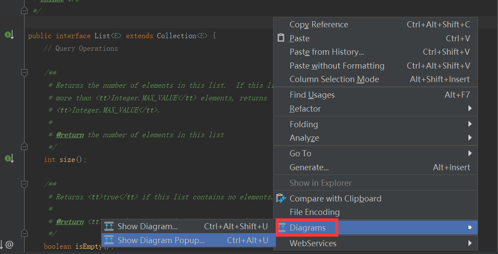
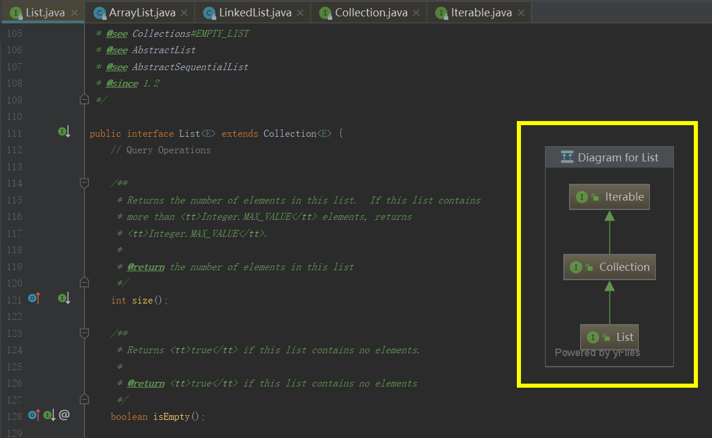
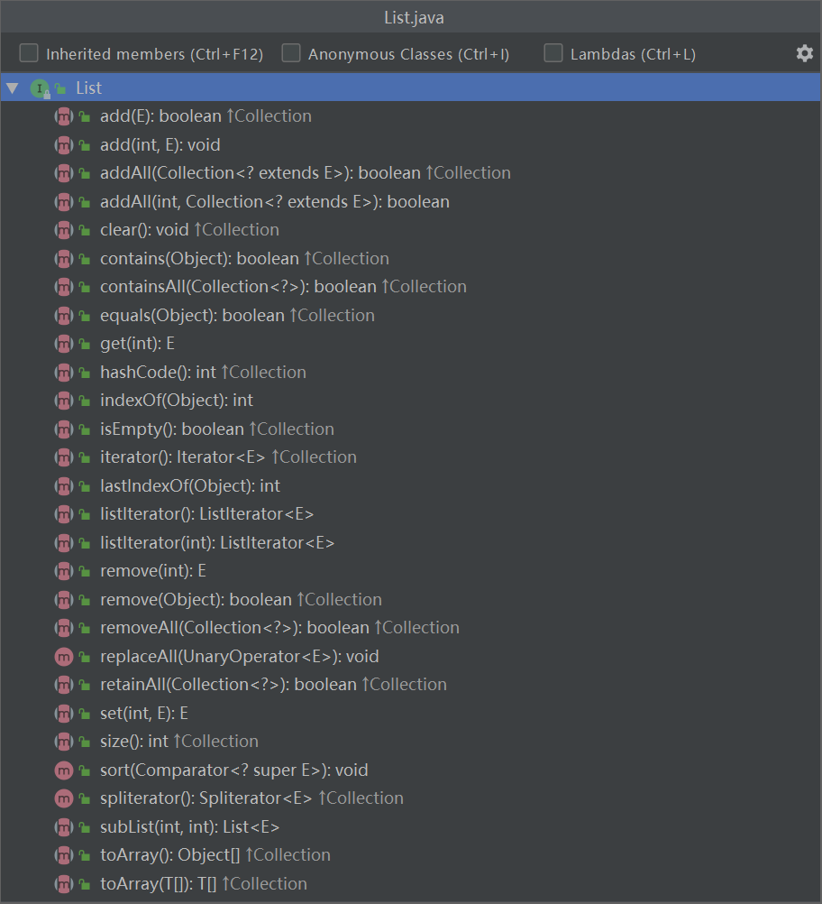
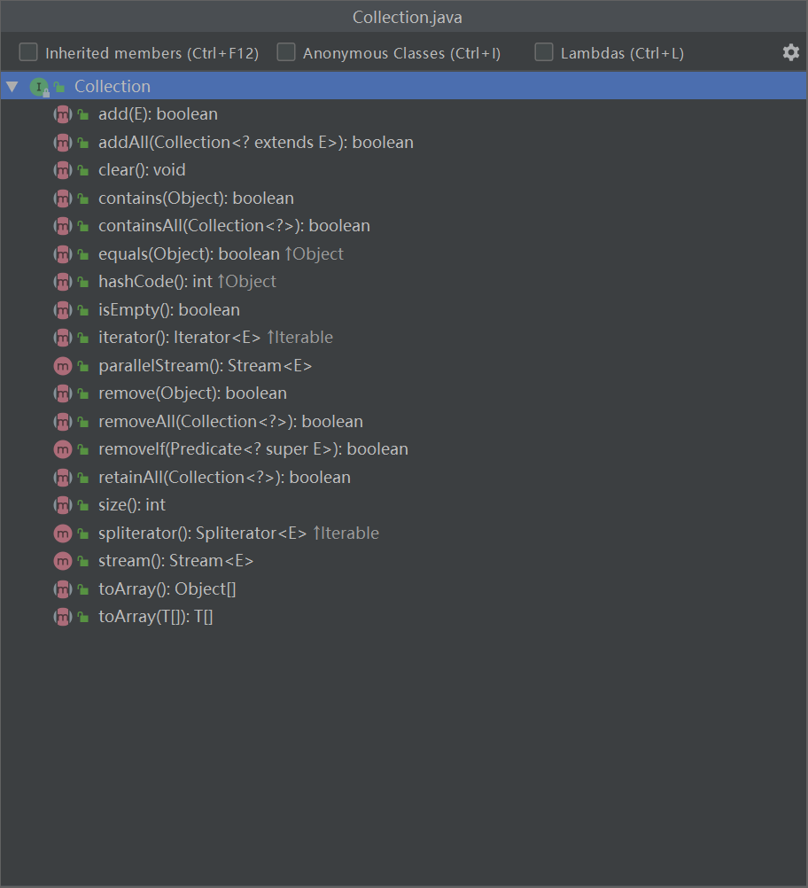
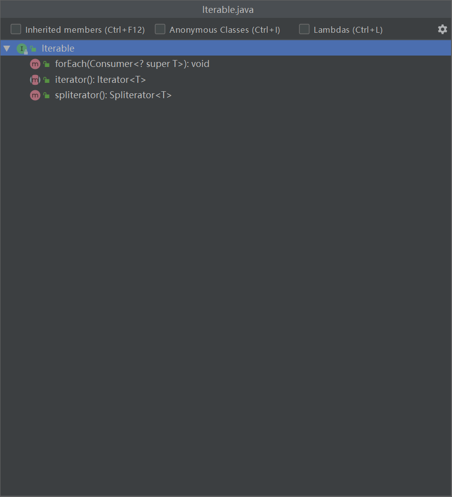
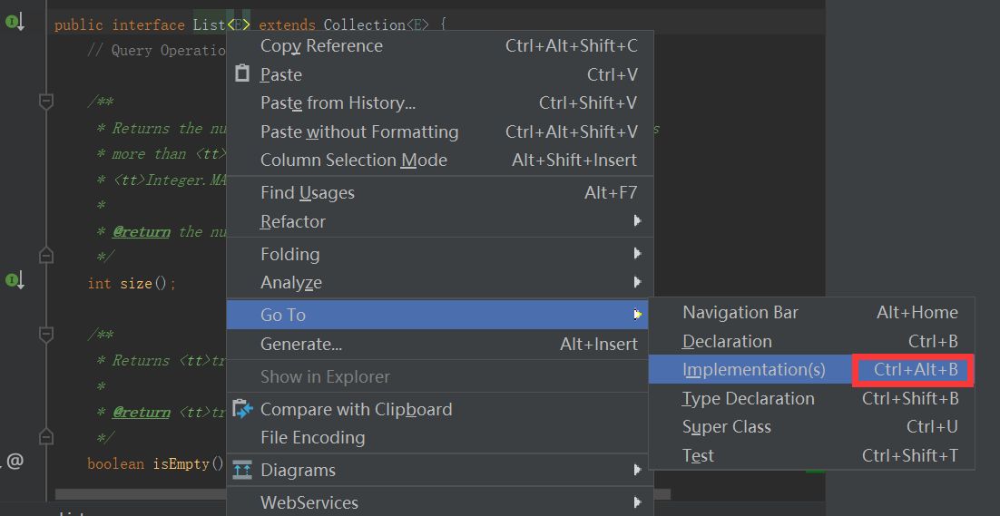
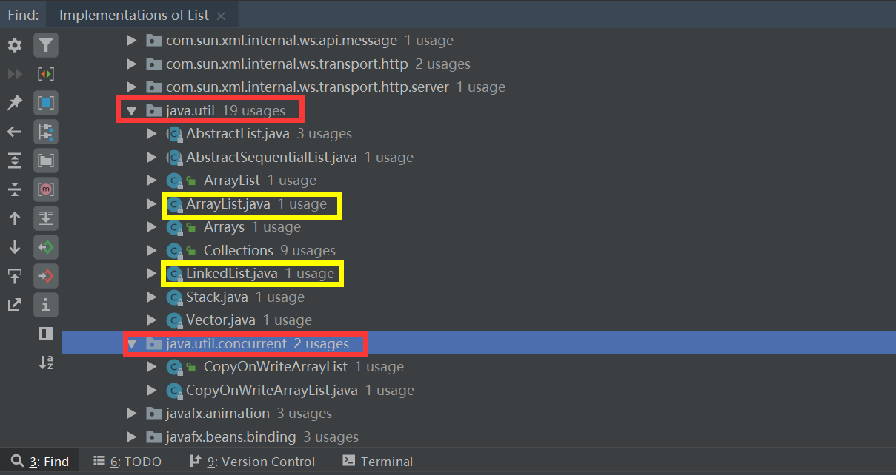
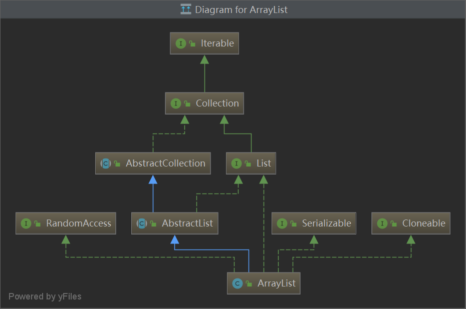
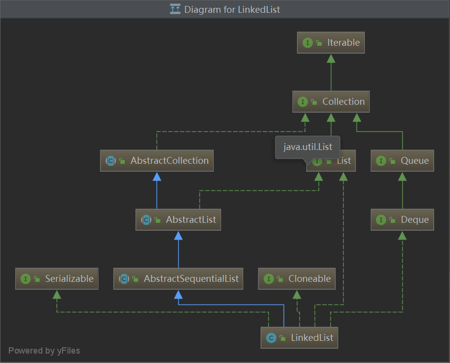

# 如何学习

学习无非横向纵向对比思考。以 `List` 接口学习为例

# 先看定义/大纲





按 `Ctrl+F12` 或者 `ALT+7` 看大纲，把方法都看一遍，有些方法看名字就知道什么意思怎么用，有些则要去看看注释。

- List的大纲
  


把继承/实现的每一个的大纲都看看。

- Collection的大纲
  


- Iterable的大纲
  


# 再看实现类



重点看看jdk实现了那些（`java.`开头的），挑重要的来看看



如这里选择最常规的 `ArrayList` 和 `LinkedList` 来查看。

- 看继承/实现图



每一个接口和父类都一样的查看思路。在查看的过程中，思考和学习jdk的代码结构思路，为什么他这样划分，自己设计会怎么样设计，自己的设计有什么问题，jdk的设计有什么好处，这才是最重要、对自己提升最大的部分。

接着看 `LinkedList` 的图，比较和思考他们的异同。



# 构造方法很重要

构造方法的`参数`，可以看出很多东西。

- ArrayList 构造方法

```java
/**
    * Constructs an empty list with the specified initial capacity.
    *
    * @param  initialCapacity  the initial capacity of the list
    * @throws IllegalArgumentException if the specified initial capacity
    *         is negative
    */
public ArrayList(int initialCapacity) {
    if (initialCapacity > 0) {
        this.elementData = new Object[initialCapacity];
    } else if (initialCapacity == 0) {
        this.elementData = EMPTY_ELEMENTDATA;
    } else {
        throw new IllegalArgumentException("Illegal Capacity: "+
                                            initialCapacity);
    }
}

/**
    * Constructs an empty list with an initial capacity of ten.
    */
public ArrayList() {
    this.elementData = DEFAULTCAPACITY_EMPTY_ELEMENTDATA;
}

/**
    * Constructs a list containing the elements of the specified
    * collection, in the order they are returned by the collection's
    * iterator.
    *
    * @param c the collection whose elements are to be placed into this list
    * @throws NullPointerException if the specified collection is null
    */
public ArrayList(Collection<? extends E> c) {
    elementData = c.toArray();
    if ((size = elementData.length) != 0) {
        // c.toArray might (incorrectly) not return Object[] (see 6260652)
        if (elementData.getClass() != Object[].class)
            elementData = Arrays.copyOf(elementData, size, Object[].class);
    } else {
        // replace with empty array.
        this.elementData = EMPTY_ELEMENTDATA;
    }
}
```

- LinkedList 构造方法

```java
/**
    * Constructs an empty list.
    */
public LinkedList() {
}

/**
    * Constructs a list containing the elements of the specified
    * collection, in the order they are returned by the collection's
    * iterator.
    *
    * @param  c the collection whose elements are to be placed into this list
    * @throws NullPointerException if the specified collection is null
    */
public LinkedList(Collection<? extends E> c) {
    this();
    addAll(c);
}
```

- 思考
  - 为什么 `LinkedList` 没有参数为 `int` 的构造方法？不懂就看完实现原理在解答