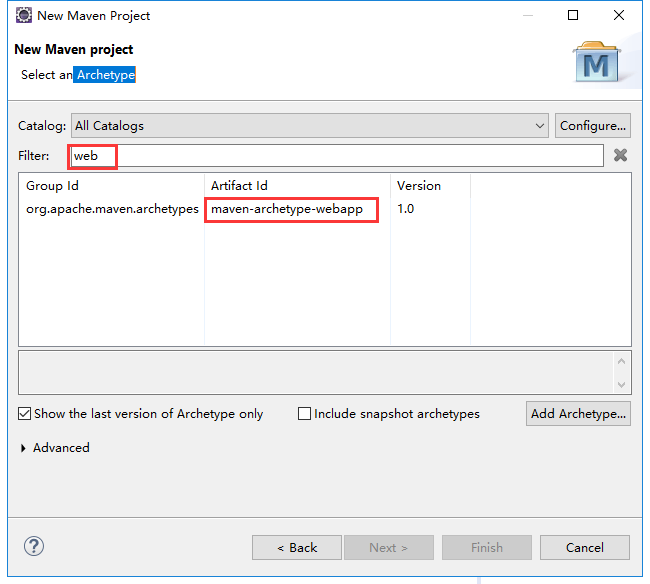
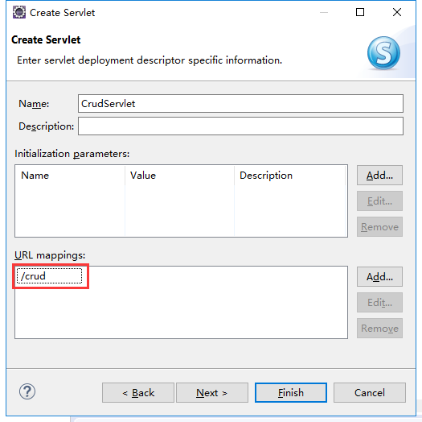
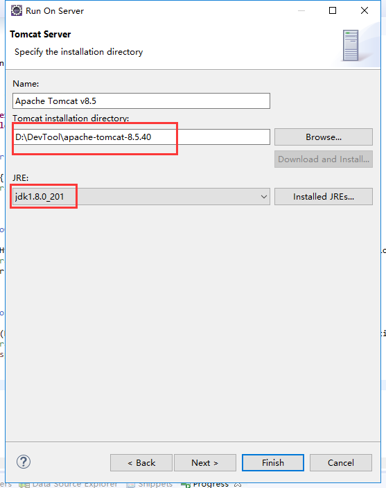
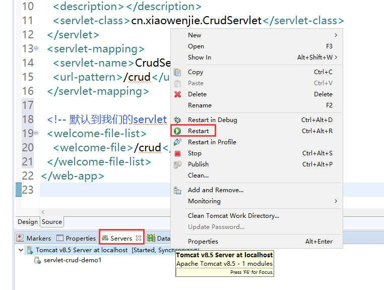
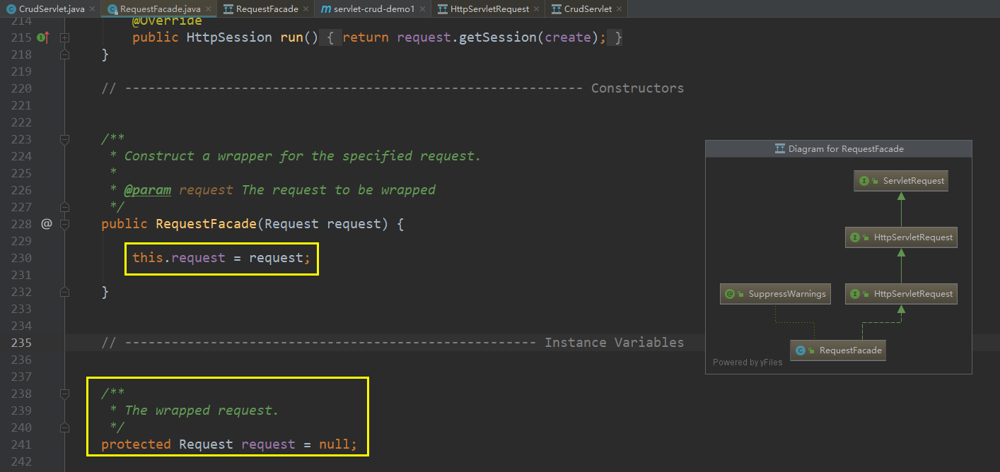
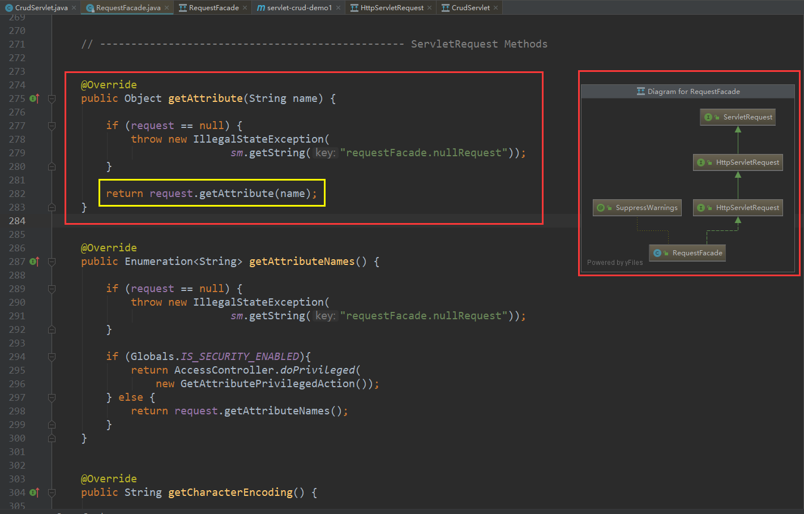

# 空白的servlet工程

[代码目录](../j2ee-eclipse-projects/servlet-blank)

## 创建工程

### 新建maven工程

新建maven工程， Archetype 里面选择 webapp 模板。



### 添加servlet

在源代码目录新建serlet


> 图片里面的 `Source Folder` 是错的。应该是 `src\main\java`，如果没有，手工创建并刷新。

下一步中，把url mapping修改一下，这就是你在url里面敲入访问的地址




servlet 创建完毕

### 增加依赖

在 `pom.xml` 中增加servlet依赖

在 `dependencies` 节点内，增加 `servlet-2.5` 的依赖

```xml
<dependency>
    <groupId>javax.servlet</groupId>
    <artifactId>servlet-api</artifactId>
    <version>2.5</version>
    <scope>provided</scope>
</dependency>
```

### 测试工程

在工程上点击右键，选择 `run as` ->  `run on server`， 选择对应的`tomcat`版本


接下来选择tomcat的目录和对应的jdk



点击Finnish。弹出的url中看到以下页面为成功


## 了解细节

### servlet 配置

新增了servlet后， 项目的 `webapp\WEB-INF\web.xml` 中新增了如下配置:

```xml
<web-app>
  <display-name>Archetype Created Web Application</display-name>
  <servlet>
  	<servlet-name>CrudServlet</servlet-name>
  	<display-name>CrudServlet</display-name>
  	<description></description>
  	<servlet-class>cn.xiaowenjie.CrudServlet</servlet-class>
  </servlet>
  <servlet-mapping>
  	<servlet-name>CrudServlet</servlet-name>
  	<url-pattern>/crud</url-pattern>
  </servlet-mapping>
</web-app>
```

> `/crud` 应该配置为 `/crud/*` ，否则容易出各种奇怪的404问题


可以看出，这里配置了servlet的名字，描述，对应的处理类，已经映射的url格式。其中 `url-pattern` 的配置是重点。

仔细阅读，这里有很多坑。 [servlet的url-pattern匹配规则](https://www.cnblogs.com/canger/p/6084846.html)

### servlet 简单工作机制了解

上面我们看到的 `hello world`，并不是我们servlet返回的。而是 `index.jsp` 返回的。当我们没有带任何路径的时候，web app 应用会去读取存在的 `welcome-file-list` 配置。我们现在没有配置，他会有一个默认的列表。如果你想默认`index.html`, 或者默认是我们的 `servlet`。你可以增加对应的配置。

如，我们把默认的页面设置为我们的`servlet`。我们的 `servlet` 的 `url mapping` 是 `/crud`。那么我们在 `web.xml` 增加配置

```xml
<web-app>
  <display-name>Archetype Created Web Application</display-name>
  <servlet>
  	<servlet-name>CrudServlet</servlet-name>
  	<display-name>CrudServlet</display-name>
  	<description></description>
  	<servlet-class>cn.xiaowenjie.CrudServlet</servlet-class>
  </servlet>
  <servlet-mapping>
  	<servlet-name>CrudServlet</servlet-name>
  	<url-pattern>/crud</url-pattern>
  </servlet-mapping>
  
  <!-- 默认到我们的servlet -->
  <welcome-file-list>
 	<welcome-file>crud</welcome-file> 
  </welcome-file-list>
</web-app>
```

重新运行



看到如下画面


和我们访问 `/crud` 结果是一样的。

接下来，我们简单看看servlet的工作机制，打开刚刚的servlet代码

```java
public class CrudServlet extends HttpServlet {
	private static final long serialVersionUID = 1L;

	public CrudServlet() {
	}

	protected void doGet(HttpServletRequest request, HttpServletResponse response)
			throws ServletException, IOException {
		response.getWriter().append("Served at: ").append(request.getContextPath());
	}

	protected void doPost(HttpServletRequest request, HttpServletResponse response)
			throws ServletException, IOException {
		doGet(request, response);
	}
}
```

可以看出，servlet 根据请求的方法（`http method`），找到对应的处理方法（`get`方法就调用`doGet`，`post`方法就调用 `doPost`）。然后从`request`里面获取数据，处理完写出到 `response`。这里没有任何处理，直接往`response`上写了一行文本而已。

- 重点知识
  - POST/GET语义区别
  - HTTP请求格式，每一个Header的重要（重中之重）
  - Request/Response上的方法（重中之重）

- 思考题
  - 前台传递给Servlet的数据格式有哪些，Servlet如何获取到？
  - Servlet如何返回json，浏览器如何区分？

## 进阶

我们把参数里面的 request 和 response 的 具体类名打印出来，得到结果如下：

```
class org.apache.catalina.connector.RequestFacade
class org.apache.catalina.connector.ResponseFacade
```

看名字。就知道是设计模式里面的 Facade 外观模式。看UML图：





而且，看类名知道是tomcat的实现类，当然在不同的serlvet容器运行的时候，实现类肯定是不一定的。

## 踩坑指导

我这个eclipse版本创建出来的工程，居然没有自动生成 `src\main\java` 和 `src\test\java` 目录。所以需要手动生成一下。

生成的servlet的java代码，也需要移动到 `src\main\java` 目录中。
