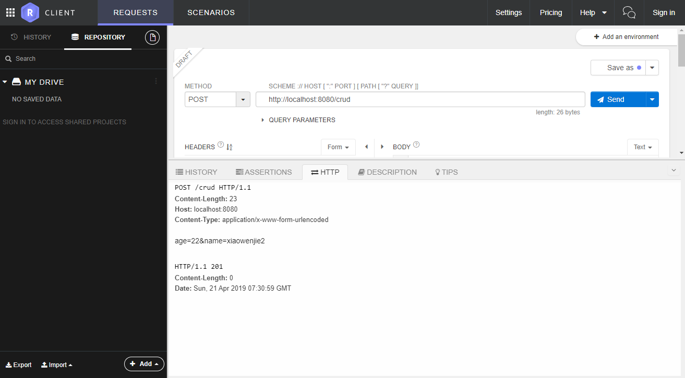

# CRUD基本开发

## 需求

使用http对应的method实现CRUD。`Restful` 就是这样的。实际工作中不会这样用。

- GET 方法，带id查询对应的数据，不带id查询所有数据
- POST 方法，新建数据
- DELETE 方法，删除数据
- PUT方法，修改数据

## 实现步骤

- 定义数据结构

定义`User`对象，定义如下

| 字段名 | 含义 | 类型 |
| :--: | :---: | :--:|
| ID    | id  | int |
| AGE   |年龄|  int|
| NAME  | 名字 | String |

- 定义接口

接口最重要的是输入输出，然后是正常异常场景。

## 编码实现

先创建一个 `UserService` 类，把crud操作放里面，然后servlet里面是入口，调用里面的方法。

Servlet 中增加对于的方法， doPut, doGet, doPost, doDelete 4个方法，然后获取参数，调用 UserService 方法，返回数据到前台。

### 创建数据

```java
protected void doPost(HttpServletRequest request, HttpServletResponse response)
        throws ServletException, IOException {
    // POST方法里面调用getParameter方法
    // 如果没有 Content-Type: application/x-www-form-urlencoded 参数必须在url上
    // 如果有，参数在url或者body上都可以
    // 实际上不太需要纠结这些细节，spring等框架封装好了

    // FIXME 实际上做好判空等异常
    int age = Integer.parseInt(request.getParameter("age"));
    String name = request.getParameter("name");

    User user = this.userService.createUser(name, age);
    System.out.println("user create success:" + user);

    // 创建成功，可以返回新对象
    // RESTFUL 的规范是返回201（body无东西），对象创建成功  201 Created.
    // 也可以返回 204，无内容
    response.setStatus(201);
}
```



- 问题
  
`http://localhost:8080/crud` 提交成功，`http://localhost:8080/crud/` 多了一个斜杆后，提交报 `404` 错误。

- 解决

```xml
<servlet-mapping>
  <servlet-name>CrudServlet</servlet-name>
  <url-pattern>/crud</url-pattern>
</servlet-mapping>
```

改为

```xml
<servlet-mapping>
  <servlet-name>CrudServlet</servlet-name>
  <url-pattern>/crud/*</url-pattern>
</servlet-mapping>
```

## 改进地方

id 应该用long类型
考虑多个请求并发，使用线程安全的id序列和map